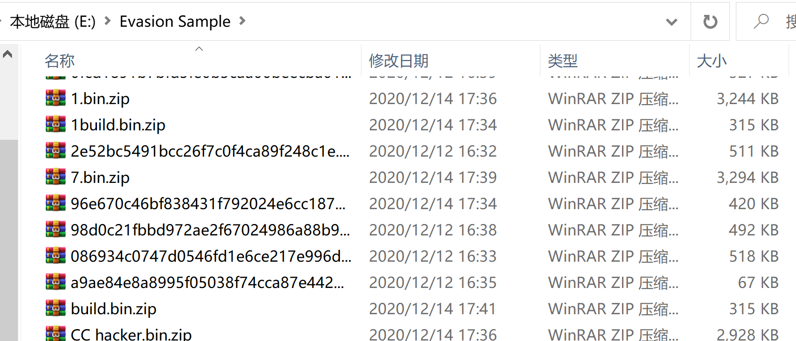
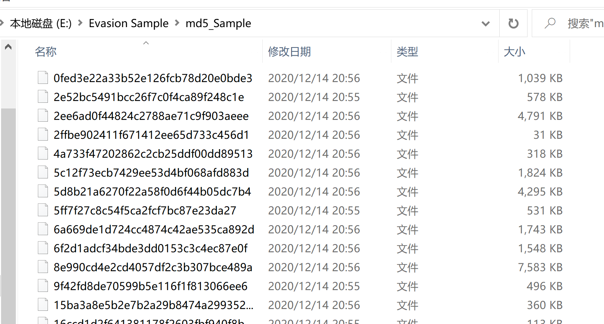
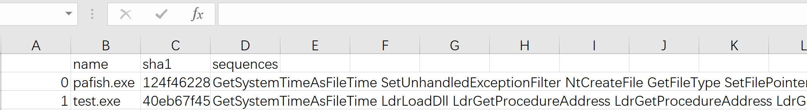

# Awesome-Scripts
## Some Useful Python Script Tools
1. [unzip](./unzip.py) 批量解压带密码的压缩包，并将解压后的文件名改为文件的md5值
* 解压改名前后状态

2. [json_parser](./json_parser.py) 解析Cuckoo分析报告中的API sequences，保存为API_sequences.csv，csv文件保存在当前工作目录下
* API_sequences.csv

